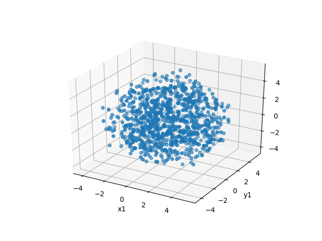
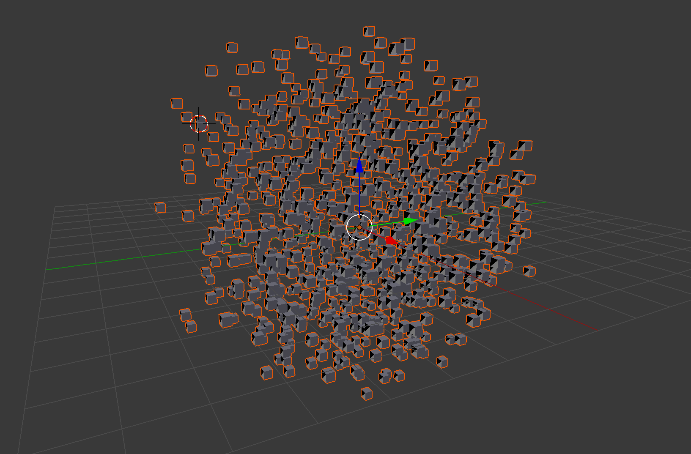

Pandas to 3D Model
==================

Pandas to 3D Model is written in Python 3.x.

Python 3 and libraries
----------------------

Virtualenv:
```shell
$ sudo pip install virtualenv
$ virtualenv --no-site-packages env
```

Matplotlib binary dependencies:
https://matplotlib.org/users/installing.html#macos
```shell
$ xcode-select --install
$ # (for subprocess32)
$ python3 -m pip install matplotlib
$ # Docs say...
$ python3 -mpip install -U pip
$ python3 -mpip install -U matplotlib
```

Pandas:
http://pandas.pydata.org/
```shell
$ python3 -m pip install pandas
```

Usage
-----


To run the tests (which generate output)
```shell
$ source env/bin/activate
$ python3 -m pip install --user '.'
$ python3 -m unittest discover '.'
```

To avoid this:
`Command "python setup.py egg_info" failed with error code 1 in`
Start with:
```bash
export LC_ALL=en_US.UTF-8
export LANG=en_US.UTF-8
```

Output
------

3D scatter plot using matplotlib:


3D scatter plot to a Wavefront .obj:

(Screen shot from Blender)

5k.rect.normal.ascii from http://www.cs.du.edu/~leut/MultiDimData.html

To view the .obj files
```shell
$ python3 -m http.server
```
Browse: [click the splash graphic and locate ./output/scatter_plot_3d_object.obj](http://0.0.0.0:8000/examples/OBJViewer.html)
Browse: [not working](http://0.0.0.0:8000/examples/OBJViewer.html?fileURL=http://0.0.0.0:8000/output/scatter_plot_3d_object.obj)
Source: https://kitware.github.io/vtk-js/examples/OBJViewer.html

Example from https://people.sc.fsu.edu/~jburkardt/data/obj/cube.obj
```shell
# cube.obj
# Source: https://people.sc.fsu.edu/~jburkardt/data/obj/cube.obj
#
 
g cube
 
v  0.0  0.0  0.0
v  0.0  0.0  1.0
v  0.0  1.0  0.0
v  0.0  1.0  1.0
v  1.0  0.0  0.0
v  1.0  0.0  1.0
v  1.0  1.0  0.0
v  1.0  1.0  1.0

vn  0.0  0.0  1.0
vn  0.0  0.0 -1.0
vn  0.0  1.0  0.0
vn  0.0 -1.0  0.0
vn  1.0  0.0  0.0
vn -1.0  0.0  0.0
 
f  1//2  7//2  5//2
f  1//2  3//2  7//2 
f  1//6  4//6  3//6 
f  1//6  2//6  4//6 
f  3//3  8//3  7//3 
f  3//3  4//3  8//3 
f  5//5  7//5  8//5 
f  5//5  8//5  6//5 
f  1//4  5//4  6//4 
f  1//4  6//4  2//4 
f  2//1  6//1  8//1 
f  2//1  8//1  4//1 
```

Dependencies
------------

Update local:
```shell
$ # Update
$ pip freeze --local | grep -v '^\-e' | cut -d = -f 1  | xargs -n1 pip install -U
```

Publish into requirements: ``
```shell
$ python3 -m pip freeze >> requirements.txt
```

Backlog
=======

A categorised set of enhancements from random thoughts with only the most brief filter

- [+] Output to Text
- [+] Output to MatPlotLib 3d scatter
- [&nbsp;&nbsp;] Output to Wavefront .obj

More
====

https://github.com/adam-p/markdown-here/wiki/Markdown-Cheatsheet
https://polycode.co.uk
https://people.sc.fsu.edu/~jburkardt/data/obj/obj.html